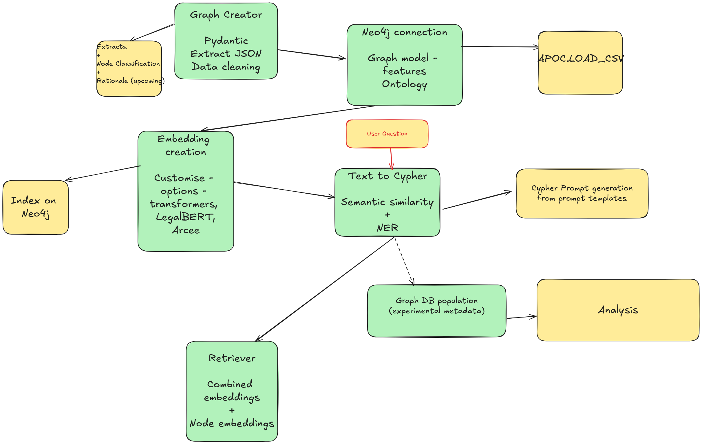
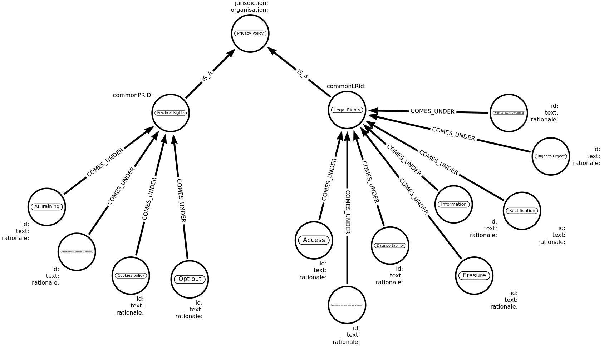

# Draft-PrivacyPolicyAnalyser
A Draft Repository for the Privacy Policy Analyser due for publication very soon. 

Made for the purpose of implementing a Graph Model that represents a feedback capable ontology.

Most aspects are still being worked upon and will be published later.

This repository is for demonstrating the approach towards:
1. Graph Creation - Involving Pydantic Classes and LLM Prompting through descriptions
2. Using semantic similarity to implement an intelligent matching system for structured output generation through templates.
3. Cypher prompts for creating differential approaches to cypher prompts of different kinds.

See Flowchart  for a demonstration of full intended approach

And Graph Model 